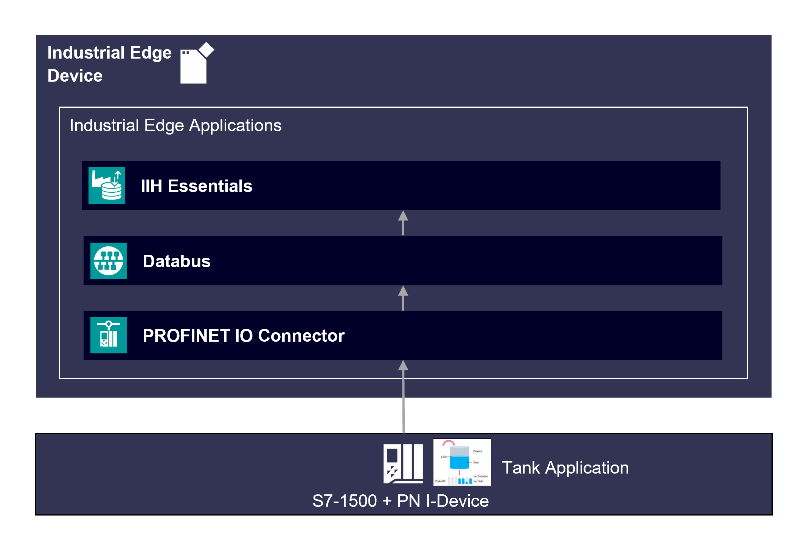

# PROFINET IO Connector Getting Started

This example shows how to use the Industrial Edge App “PROFINET IO Connector”.

- [PROFINET IO Connector application example](#profinet-io-connector-application-example)
  - [Description](#description)
    - [Overview](#overview)
    - [General task](#general-task)
  - [Requirements](#requirements)
    - [Prerequisities](#prerequisities)
    - [Used components](#used-components)
    - [TIA Project](#tia-project)
  - [Configuration steps](#configuration-steps)
  - [Usage](#usage)
  - [Documentation](#documentation)
  - [Contribution](#contribution)
  - [Licence and Legal Information](#licence-and-legal-information)
  - [Disclaimer](#Disclaimer)

## Description

### Overview

This document describes how you can implement a PROFINET IO Controller which cyclically reads the PN IO data of the configured PROFINET network.

### General task

In this example the PN IO data of PROFINET network are cyclically read using the PROFINET IO Connector application. The data are published via the PROFINET IO Connector in binary data form or JSON data form on the IE databus. First, the PROFINET IO Connector must be configured in the Common Configurator application. The XML file exported from TIA Portal including the PROFINET configuration should be uploaded in this step. The IE Databus will transfer the data from the PROFINET IO Connector for further processing under the respective topic. This data can be further processed in the applicatios such as IIH Essentials or FlowCreator.

## Requirements

###  Prerequisities

- Access to an Industrial Edge Management System (IEM)
- Onboarded Industial Edge Device (IED) on IEM
- Installed System Configurators for Databus
- Installed System Apps Databus
- Installed Apps Data Service, PROFINET IO Connector
- Edge device is connected to PLC
- TIA portal project loaded on PLC (e.g. for filling application)
- Google Chrome (Version ≥ 72) or Firefox (Version ≥ 62)

### Used components

- Industrial Edge Management (IEM) V1.5.2-4
- Industrial Edge Device (IED) IPC227E V1.12.0-10
- Common Configurator V1.8.1-1
- Registry Service V1.8.0-4
- PROFINET IO Connector 2.1.0-4
- IIH Essentials V1.8.1
- TIA Portal V18
- S7-1515-2 PN
- Web browser (Google Chrome)

### TIA Project

The used TIA Portal project can be found in the [miscellenous repository](https://github.com/industrial-edge/miscellaneous/tree/main/tank%20application). This project is also used for several further application examples. It is preferred to configure the PROFINET Driver from scratch to be aware of configuration. In case of some issues in the TIA Portal, the same project where the mentioned configuration is already done can be found in the [src](src) directory under the following name: 
- [EdgeHowTos.7z](src/EdgeHowTos.7z).

## Configuration steps

- Configure PROFINET Driver in TIA Portal
- Configure IED Layer 2 access
- Configure Databus
- Configure PROFINET IO Connector in Common Configurator
- Configure tags' reading in IIH Essentials

You can find the further information about the following steps in the [Documentation](docs/Installation.md).

## Usage

Once the PROFINET IO Connector application is configured, the data can be read from the PLC in binary or JSON form and made available for further processing in the IIH Essentials or in the Flow Creator application.

## Documentation

You can find further documentation and help in the following links
  - [PROFINET IO Connector documentation](https://cache.industry.siemens.com/dl/files/037/109825037/att_1157413/v2/PROFINET_IO_Connector_enUS_V2.1.0_en-US.pdf)
  - [Industrial Edge Hub](https://iehub.eu1.edge.siemens.cloud/#/documentation)
  - [Industrial Edge Forum](https://www.siemens.com/industrial-edge-forum)
  - [Industrial Edge landing page](https://new.siemens.com/global/en/products/automation/topic-areas/industrial-edge/simatic-edge.html)
  
## Contribution

Thank you for your interest in contributing. Anybody is free to report bugs, unclear documentation, and other problems regarding this repository in the Issues section. Additionally everybody is free to propose any changes to this repository using Pull Requests.

If you haven't previously signed the [Siemens Contributor License Agreement](https://cla-assistant.io/industrial-edge/) (CLA), the system will automatically prompt you to do so when you submit your Pull Request. This can be conveniently done through the CLA Assistant's online platform. Once the CLA is signed, your Pull Request will automatically be cleared and made ready for merging if all other test stages succeed.

## License and Legal Information

Please read the [Legal information](LICENSE.txt).

## Disclaimer

IMPORTANT - PLEASE READ CAREFULLY:

This documentation describes how you can download and set up containers which consist of or contain third-party software. By following this documentation you agree that using such third-party software is done at your own discretion and risk. No advice or information, whether oral or written, obtained by you from us or from this documentation shall create any warranty for the third-party software. Additionally, by following these descriptions or using the contents of this documentation, you agree that you are responsible for complying with all third party licenses applicable to such third-party software. All product names, logos, and brands are property of their respective owners. All third-party company, product and service names used in this documentation are for identification purposes only. Use of these names, logos, and brands does not imply endorsement.
