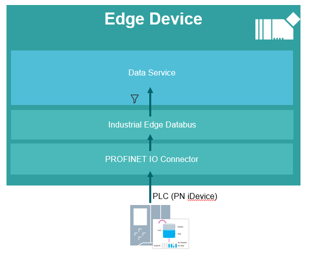

# PROFINET IO Connector application example

This example shows how to use the Industrial Edge App “PROFINET IO Connector”.

- [PROFINET IO Connector application example](#profinet-io-connector-application-example)
  - [Description](#description)
    - [Overview](#overview)
    - [General task](#general-task)
  - [Requirements](#requirements)
    - [Prerequisities](#prerequisities)
    - [Used components](#used-components)
    - [TIA Project](#tia-project)
  - [Configuration steps](#configuration-steps)
  - [Usage](#usage)
  - [Documentation](#documentation)
  - [Contribution](#contribution)
  - [Licence and Legal Information](#licence-and-legal-information)

## Description

### Overview

This document describes how you can implement a PROFINET Controller which cyclically reads the PN IO data of the configured PROFINET network.

### General task

This example cyclically reads PN IO data of a configured PROFINET network. The data is published via the PROFINET IO Connector in binary data form or Json data form on the IE data bus. First, the PROFINET IO Connector must be configured with the respective app configuration files and must be selected during the installation of the PROFINET IO Connector. The files are used to make various settings for the PROFINET IO Connector. 
The IE Databus will transfer the data from the PROFINET IO Connector for further processing under the respective topic. This data can be further processed in the FlowCreator or in the Data Service.

## Requirements

###  Prerequisities

- Access to an Industrial Edge Management System (IEM)
- Onboarded Industial Edge Device (IED) on IEM
- Installed System Configurators for Databus
- Installed System Apps Databus
- Installed Apps Data Service, PROFINET IO Connector
- Edge device is connected to PLC
- TIA portal project loaded on PLC (e.g. for filling application)
- Google Chrome (Version ≥ 72) or Firefox (Version ≥ 62)

### Used components

- Industrial Edge Management (IEM) V1.3.0-58
- IE Databus Configurator V1.4.22
- IE Databus V1.3.5
- Data Service 1.3.0
- PROFINET IO Connector 1.1.0
- Industrial Edge Device V 1.3.0-57
- TIA Portal V17
- S7-1515
- Web browser (Mozilla or Chrome)

### TIA Project

The used TIA Portal project can be found in the [miscellenous repository](https://github.com/industrial-edge/miscellaneous/tree/main/tank%20application) and is also used for several further application examples.

## Configuration steps

You can find the further information about the following steps in the [docs](docs/Installation.md)
- Configure IED Layer 2 access
- Configure PROFINET IO Connector
- Configure Databus and Data Service

## Usage

Once the PROFINET IO Connector App is configured, data can be read from the PLC in binary or json form and made available for further processing in the Data Service or in the Flow Creator.

## Documentation

You can find further documentation and help in the following links
  - [Industrial Edge Hub](https://iehub.eu1.edge.siemens.cloud/#/documentation)
  - [Industrial Edge Forum](https://www.siemens.com/industrial-edge-forum)
  - [Industrial Edge landing page](https://new.siemens.com/global/en/products/automation/topic-areas/industrial-edge/simatic-edge.html)
  
## Contribution

Thanks for your interest in contributing. Anybody is free to report bugs, unclear documenation, and other problems regarding this repository in the Issues section or, even better, is free to propose any changes to this repository using Merge Requests.

## Licence and Legal Information

Please read the [Legal information](LICENSE.md).
