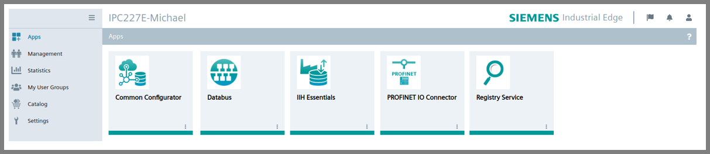

# PROFINET IO Connector Getting Started: Configuration of PROFINET IO Connector in IED

- [PROFINET IO Connector Getting Started: Configuration of PROFINET IO Connector in IED](#profinet-io-connector-getting-started-configuration-of-profinet-io-connector-in-ied)
  - [Installation of necessary applications](#installation-of-necessary-applications)

## Installation of necessary applications

In order to configure the PROFINET IO Conenctor in IED, the following applications should be installed on your IED:

