# PROFINET IO Connector Getting Started: Configuration of PROFINET IO Connector in IED

- [PROFINET IO Connector Getting Started: Configuration of PROFINET IO Connector in IED](#profinet-io-connector-getting-started-configuration-of-profinet-io-connector-in-ied)
  - [Install necessary applications](#install-necessary-applications)
  - [Configure Common Configurator](#configure-common-configurator)
    - [Configure Databus Credentials](#configure-databus-credentials)
    - [Configure PROFINET IO Connector](#configure-profinet-io-connector)
  - [Configure IIH Essentials](#configure-iih-essentials)
    - [Configure Databus settings](#configure-databus-settings)
    - [Configure Databus settings](#configure-data-reading)

## Install necessary applications

In order to configure the PROFINET IO Conenctor in IED and check the received data from PLC, the following applications should be installed on your IED:

> [!NOTE]  
> It is assumed that the Databus is already configured.

Apart from Databus Configurator it is also necessary to have Common Connector Configurator installed in the IEM Maitenance. 

## Configure Common Configurator

### Configure Databus Credentials

Go to the Settings and open Databus Credentials tab. Fill the Databus Service name, Databus Publisher settings (User name and Password) and then click on "Save".

Then, click on "Databus Subscriber settings" and fill the User name and Password as well in there. Finally, click on "Save" again.

### Configure PROFINET IO Connector

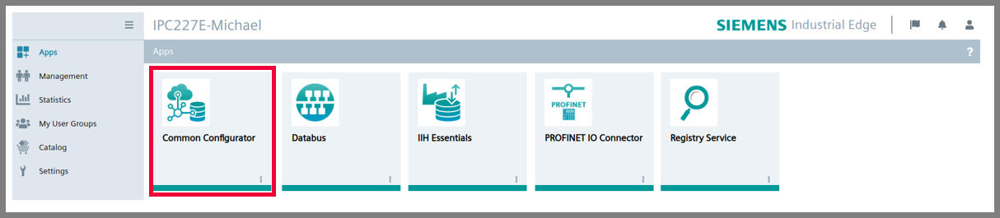

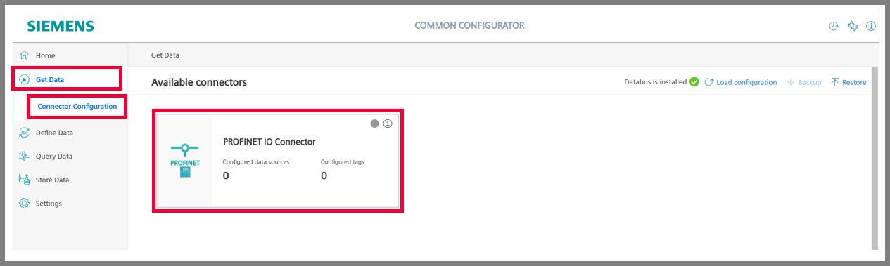

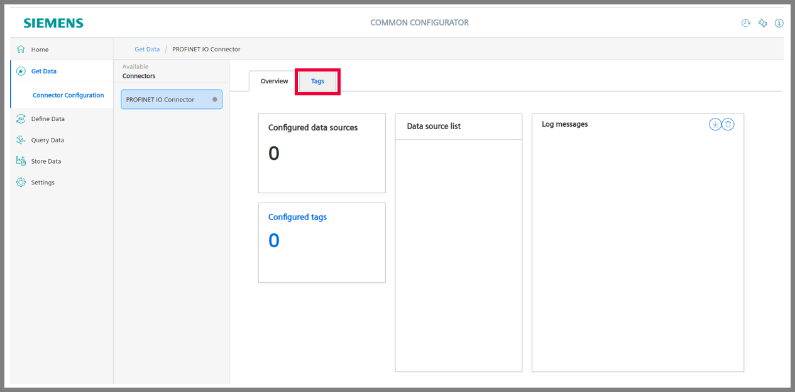

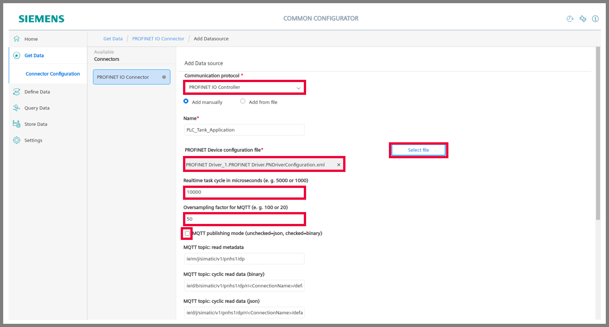

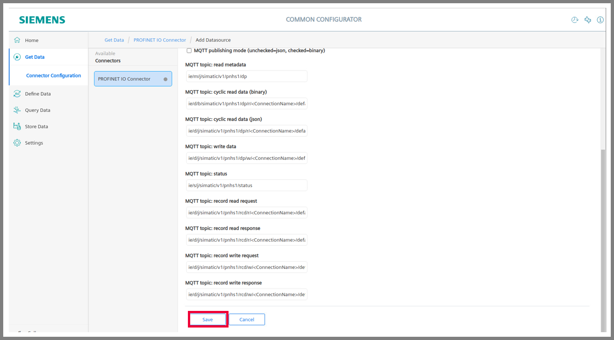

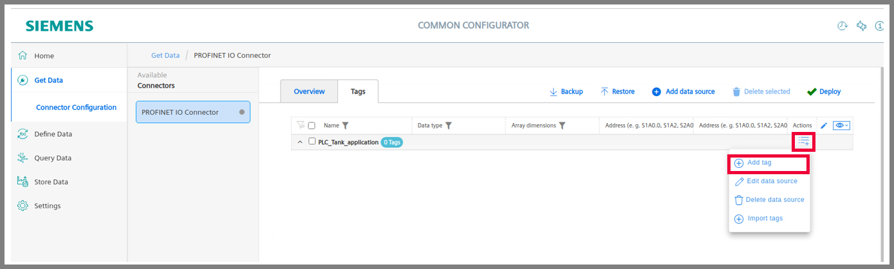

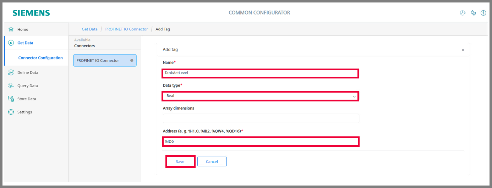

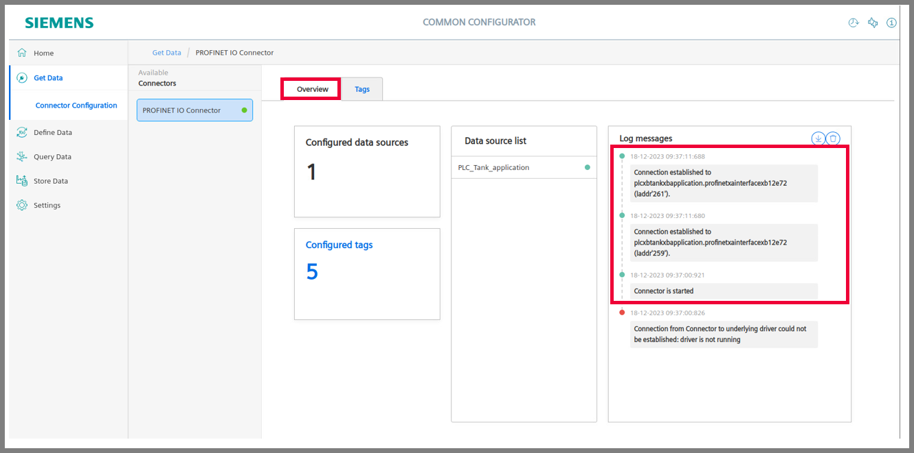

## Configure IIH Essentials

### Configure Databus settings

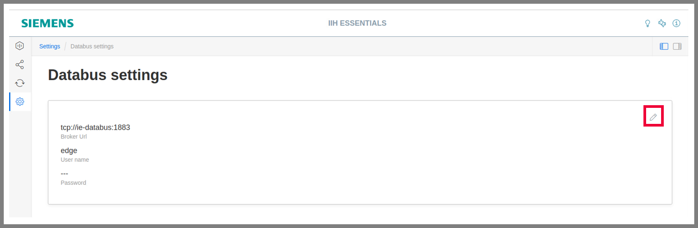

### Configure Data reading

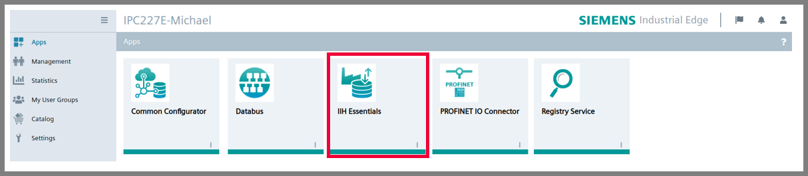

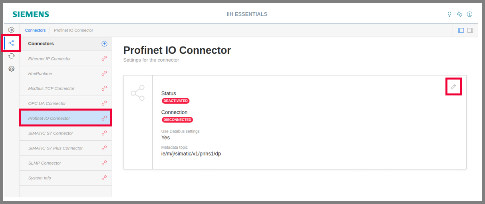

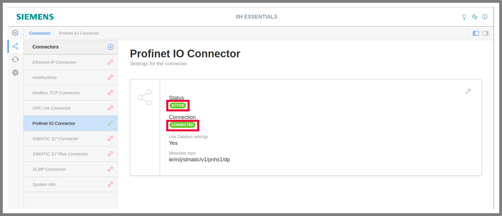

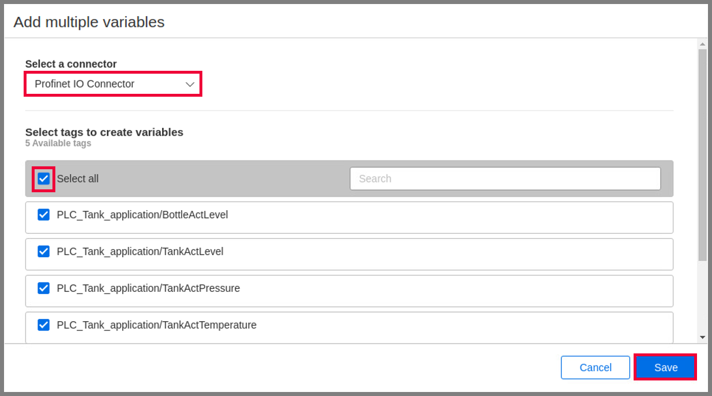

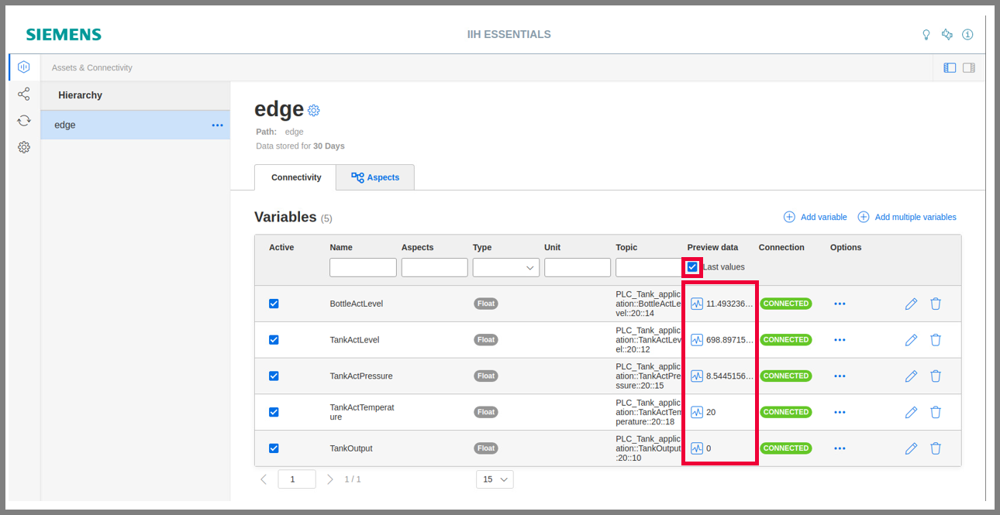
