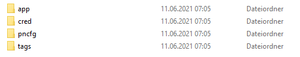

### Configure PROFINET IO Configuration Files

You have a choice in the PROFINET IO Connector between binary and JSON format. You must use the downloaded example configuration files for the respective format.

The PROFINET IO Connector application requires four configuration files that are available in the JSON or Binary folder:

- User credentials for IE Databus (pn_hs_adpt_credentials.xml)
- Application settings (pn_hs_adpt_appconfig.xml)
- Profinet configuration (e.g. generated from TIA Portal)
- optional Tag Definition File (pn_hs_adpt_tagdefs.json)

### Configure PROFINET IO with Binary format

The binary format is designed for higher performance.

For the binary format, the respective binary files must be uploaded in the Profinet IO Connector.

### Configure PROFINET IO with JSON format

The JSON format is for easier handling on the client side.

For the JSON format, the respective JSON files must be uploaded in the Profinet IO Connector.

### Configure User Credentials for IE Databus

The XML file pn_hs_adpt_appconfig.xml shows user and password for the IE Databus (MQTT broker). This configuration must match the IE Databus configuration.

### Configure Application Settings

The XML file pn_hs_adpt_appconfig.xml contains several parameters for the PROFINET IO Connector app. Every line has a comment. You can adjust the parameters according your needs, e.g.

- name of the PN config file, created by TIA Portal
- name of the optional tag defintion file
- MQTT topic names for published and subsribed topics
- Cycle time for reading the PN IO data
- Oversampling factor (how many PN IO cycles are transferred with one MQTT message)

### Configure Tag Definition

The XML file pn_hs_adpt_tagdefs.json shows the configured Tags. This configuration must match the tag table configuration.

Properties for tag definition

The supported data types for tag definitions are as follows:

- SimpleTagTypeBool
- SimpleTagTypeByte
- SimpleTagTypeWord
- SimpleTagTypeDWord
- SimpleTagTypeLWord
- SimpleTagTypeSInt
- SimpleTagTypeInt
- SimpleTagTypeDInt
- SimpleTagTypeLInt
- SimpleTagTypeUSInt
- SimpleTagTypeUInt
- SimpleTagTypeUDInt
- SimpleTagTypeULInt
- SimpleTagTypeReal
- SimpleTagTypeLReal

### Update All Configurations Files from Management (IEM)

You can download all or selected config files with the Management (IEM).
IEM >> My Installed Apps >> PROFINET IO Connector >> Update Configuration

Hint: When you change any config file, you have to restart the app (e.g. via the Web UI of the IEM) to activate the changed configuration!

