# Configuration 

- [Configuration](#configuration)
  - [Configure Device Layer 2 access](#configure-device-layer-2-access)
  - [Configure PROFINET IO Connector](#configure-profinet-io-connector)
    - [TIA Portal HSP for PN Driver](#tia-portal-hsp-for-pn-driver)
    - [Configure PROFINET IO Connector in TIA Portal](#configure-profinet-io-connector-in-tia-portal)
    - [Configure PROFINET IO Configuration Files](#configure-profinet-io-configuration-files)
      - [Configure PROFINET IO with Binary format](#configure-profinet-io-with-binary-format)
    - [Configure PROFINET IO with JSON format](#configure-profinet-io-with-json-format)
    - [Configure User Credentials for IE Databus](#configure-user-credentials-for-ie-databus)
    - [Configure Application Settings](#configure-application-settings)
    - [Configure Tag Definition](#configure-tag-definition)
    - [Update All Configurations Files from Management (IEM)](#update-all-configurations-files-from-management-iem)
  - [Configure Databus and Data Service](#configure-databus-and-data-service)
    - [Configure Databus](#configure-databus)
    - [Configure Data Service](#configure-data-service)

## Configure Device Layer 2 access

The PROFINET IO Connector requires Layer 2 access to have communication with the PLC.

Hint: Layer 2 access can only be configured for a new device, not later.

Open the management system and select "My Edge Devices" on the left side in the bar.

Click on "+ New Edge Device" on the upper right side.

Configure your Edge Device and click on "Next".

Click on the "+" button at the top right to configure the network interface.

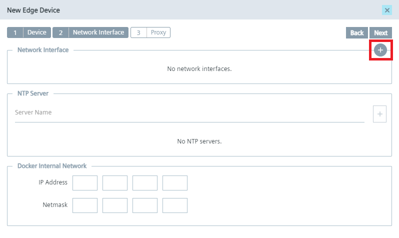

Configure the network interface and the layer 2 access and click on "add".

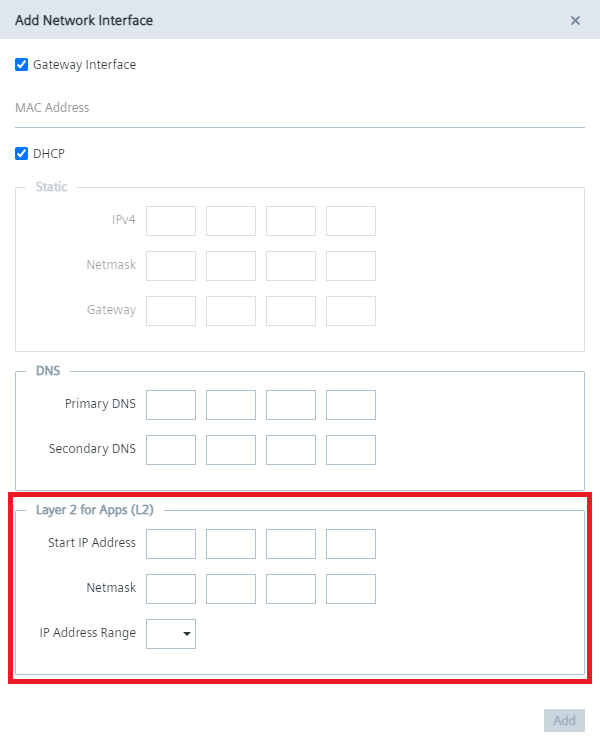

Confirm the device configuration with "Next" and with "Create".

Layer 2 configuration example:

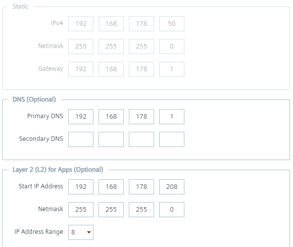

## Configure PROFINET IO Connector 

To read data from the PLC and provide the data, we will use PROFINET IO Connector to establish connection with the PLC via PROFINET.

The PROFINET IO Connector sends the data to the Databus, where the Data Service app can collect what is needed.

In order to build this infrastructure, these apps must be configured properly:

- TIA Portal HSP for PN Driver
- Databus
- Data Service
- PROFINET IO Connector

Note: During the first installation, the PROFINET IO connector is installed without files. The configuration files are configured later [Configure PROFINET IO Configuration Files](#configure-profinet-io-configuration-files) and uploaded to the app.

The PROFINET IO Connector app can be adjusted according the project's needs. 
Configurarion files enable to configure the behavior of the app.

An example of the required PROFINET IO Connector files can be downloaded here under "Appendix":

https://support.industry.siemens.com/cs/us/en/view/109793251

- User credentials for IE Databus (pn_hs_adpt_credentials.xml)
- Application settings (pn_hs_adpt_appconfig.xml)
- Profinet configuration (e.g. gerated from TIA Portal)
- optional Tag Definition file (pn_hs_adpt_tagdefs.json)

The Profinet configuration is configured with the SIMATIC TIA Portal.

### TIA Portal HSP for PN Driver

The PNDriver V2.2 is not included automatically in TIA Portal V16. You have to install the HSP (Hardware Support Package).
You can download the needed HSP 0307 from the Siemens support pages [↗ ID 72341852](https://support.industry.siemens.com/cs/ww/en/view/72341852).

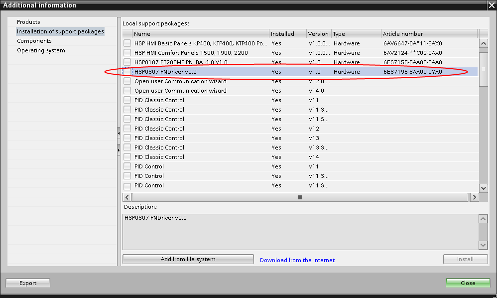

### Configure PROFINET IO Connector in TIA Portal

Click "Devices & Network" at the top of the left side.

Select the PROFINET Driver from the catalog.

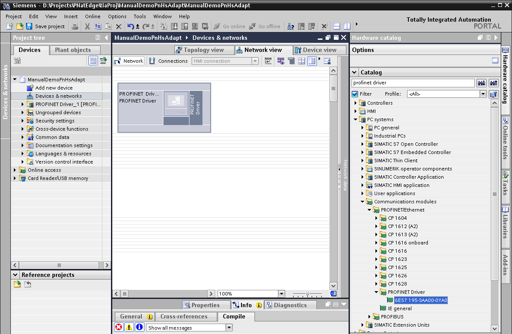

The project contains now a PC station with prepared PROFINET Driver. Switch to the Device View and connect the PLC with the PROFINET Driver.

Next you have to add to the PROFINET Driver the Linux native communication interface.

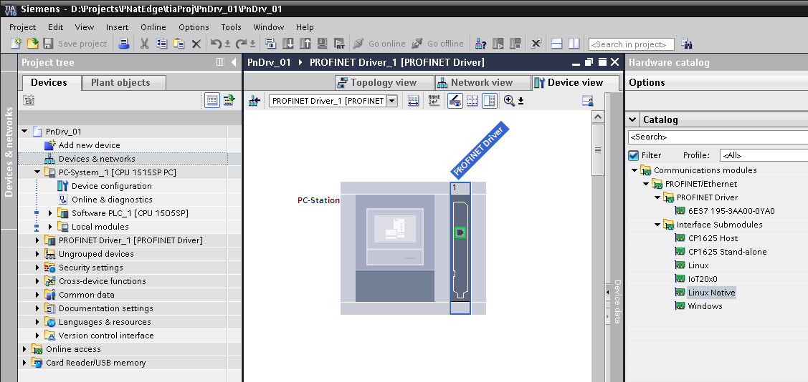

Click on the PLC properties and select the PROFINET Driver under IO device.

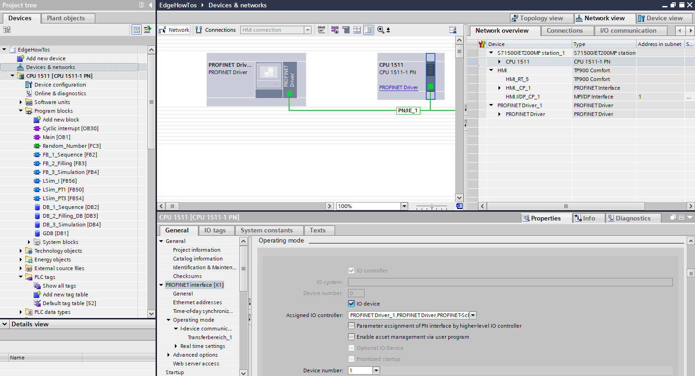

Click on "I-device communication" in the PLC properties to define the inputs, outputs and the length.

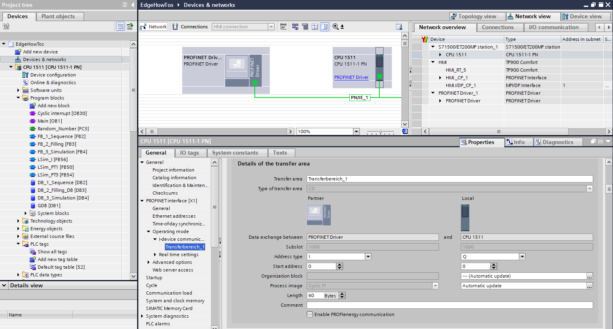

Check the transfer area from the I-Device communication.

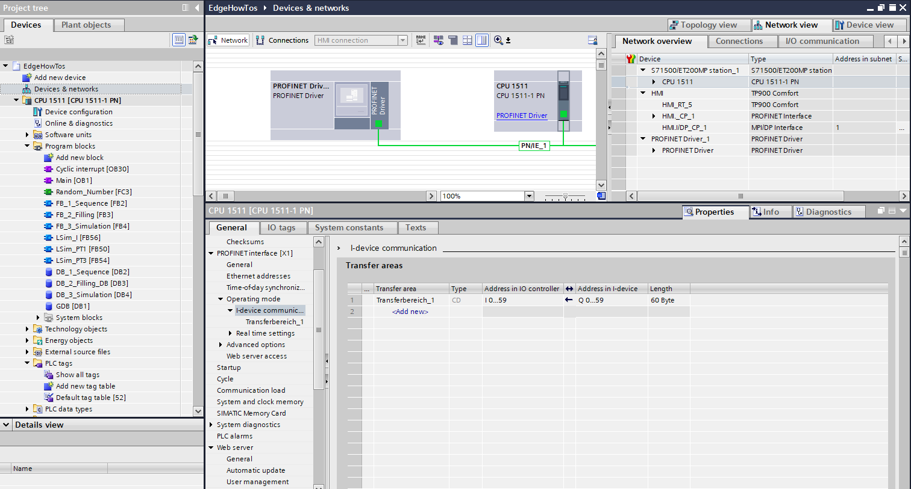

The output variables for the PROFINET IO controller are defined in the tag table. 
Select the respective variables from the "GDB DB1" and add them as output in the tag table.

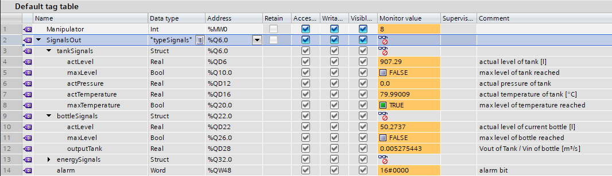

Add the tag name from the tag table to the "Main OB1".

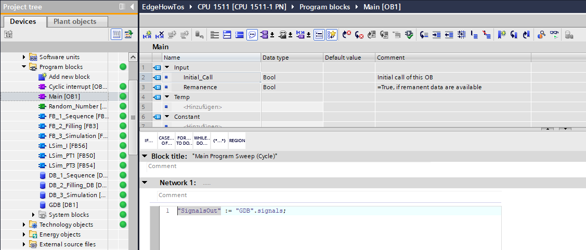

Compile the PROFINET Driver to create the XML configuration file.
This file you have to provide to the PROFINET IO Connector application.

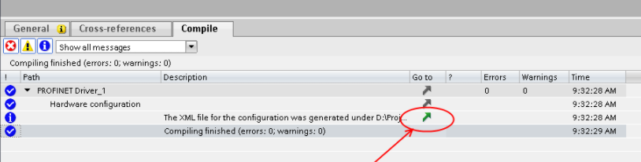

### Configure PROFINET IO Configuration Files

You have a choice in the PROFINET IO Connector between binary and JSON format. You must use the existing configuration files for the respective format.

The PROFINET IO Connector application requires four configuration files that are available in the JSON or Binary folder:

- User credentials for IE Databus (pn_hs_adpt_credentials.xml)
- Application settings (pn_hs_adpt_appconfig.xml)
- Profinet configuration (e.g. generated from TIA Portal)
- optional Tag Definition File (pn_hs_adpt_tagdefs.json)

#### Configure PROFINET IO with Binary format

The binary format is designed for higher performance.

For the binary format, the respective binary files must be uploaded in the Profinet IO Connector.

### Configure PROFINET IO with JSON format

The JSON format is for easier handling on the client side.

For the JSON format, the respective JSON files must be uploaded in the Profinet IO Connector.

### Configure User Credentials for IE Databus

The XML file pn_hs_adpt_appconfig.xml shows user and password for the IE Databus (MQTT broker). This configuration must match the IE Databus configuration.

### Configure Application Settings

The XML file pn_hs_adpt_appconfig.xml contains several parameters for the PROFINET IO Connector app. Every line has a comment. You can adjust the parameters according your needs, e.g.

- name of the PN config file, created by TIA Portal
- name of the optional tag defintion file
- MQTT topic names for published and subsribed topics
- Cycle time for reading the PN IO data
- Oversampling factor (how many PN IO cycles are transferred with one MQTT message)

### Configure Tag Definition

The XML file pn_hs_adpt_tagdefs.json shows the configured Tags. This configuration must match the tag table configuration.

Properties for tag definition

### Update All Configurations Files from Management (IEM)

You can download all or selected config files with the Management (IEM).
IEM >> My Installed Apps >> PROFINET IO Connector >> Update Configuration

Hint: When you change any config file, you have to restart the app (e.g. via the Web UI of the IEM) to activate the changed configuration!

## Configure Databus and Data Service 

### Configure Databus

In your IEM open the Databus and launch the configurator.

Add a user with this topic:
`"ie/d/b/simatic/v1/pnhs1/dp/r"`
`"ie/m/j/simatic/v1/pnhs1/dp/r"`

Deploy the configuration.

### Configure Data Service

Open the Data Service in the IED.

click on adapters and chosse the PROFINET IO Connector:

Take the settings what you have used in the Data Service:

Activate the adapter for PROFINET IO Connector:

click on "Assets & Connectivity" at the top of the left-hand page and create your first variables.

Select the PROFINET IO Connector in "Choose an Adapter" and all "profinetxadriver" in "choose a tag":

click on "Aspects" and select variables if you want to display the variables e.g. in Performance Insight.

