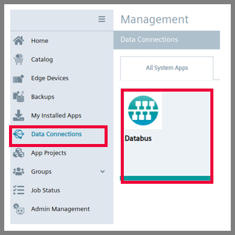
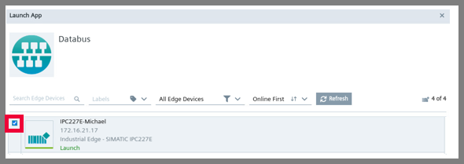
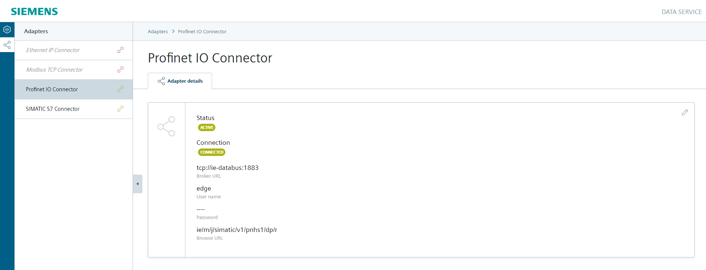

# PROFINET IO Connector Getting Started: Documentation

- [PROFINET IO Connector Getting Started: Documentation](#profinet-io-connector-getting-started-documentation)
  - [Configure IED Layer 2 access](#configure-ied-layer-2-access)
  - [Configure PROFINET IO Connector](#configure-profinet-io-connector)
    - [TIA Portal HSP for PN Driver](#tia-portal-hsp-for-pn-driver)
    - [Configure PROFINET IO Connector in TIA Portal](#configure-profinet-io-connector-in-tia-portal)
    - [Configure PROFINET IO Configuration Files](#configure-profinet-io-configuration-files)
    - [Configure PROFINET IO with Binary format](#configure-profinet-io-with-binary-format)
    - [Configure PROFINET IO with JSON format](#configure-profinet-io-with-json-format)
    - [Configure User Credentials for IE Databus](#configure-user-credentials-for-ie-databus)
    - [Configure Application Settings](#configure-application-settings)
    - [Configure Tag Definition](#configure-tag-definition)
    - [Update All Configurations Files from Management (IEM)](#update-all-configurations-files-from-management-iem)
  - [Configure Databus and Data Service](#configure-databus-and-data-service)
    - [Configure Databus](#configure-databus)
    - [Configure Data Service](#configure-data-service)

## Configure IED Layer 2 access

The PROFINET IO Connector requires Layer 2 access within the IED to enable a communication with the PLC.

> [!NOTE]  
> From version 1.3.0-57 of IED firmware (ied-os-1.3.0-57), Layer 2 can be configured after onboarding of IED. Previous versions support setting Layer 2  **only** during onboarding.

Both options are described in the following subsections.

### Configure IED Layer 2 access during onboarding of IED

Open the management system and select "My Edge Devices" on the left side in the bar and click on "+ New Edge Device" on the upper right side.

Configure your Edge Device and click on "Next".

Click on the "+" button at the top right to configure the network interface.

Configure the network interface and the layer 2 access and click on "Add".

Confirm the device configuration with "Next" and with "Create".

### Configure IED Layer 2 access of onboarded IED

In your IED go to the Settings, open the Connectivity tab and click on "LAN Network".

Go to the edditing window of your IED network adapter by clicking on pencil icon.

Configure the layer 2 access and click on "Update".

## Configuration of Databus

First of all, make sure that you have installed
- Databus Configurator application in your IEM Maintenance
- Databus application in your IEM Management

Then, in your IEM go to the Data Connections and open the Databus. Add a user with following topic: `"ie/#"` and deploy it to IED (or IEVD).

## Configure PROFINET Driver in TIA Portal

## Configure PROFINET IO Connector

There are two ways how to configure the PROFINET IO Connector
1. [Directly in IED](Configuration_IED.md) - using Common Configurator application (newest and preferable way)
2. [In IEM](Configuration_IEM.md) - PROFINET IO Configuration Files (older and more complicated way)

## Configure PROFINET IO Connector

The Profinet configuration is configured with the SIMATIC TIA Portal.

### TIA Portal HSP for PN Driver

The PNDriver V2.2 is not included automatically in TIA Portal V16. You have to install the HSP (Hardware Support Package).
You can download the needed HSP 0307 from the Siemens support pages [↗ ID 72341852](https://support.industry.siemens.com/cs/ww/en/view/72341852).

### Configure PROFINET IO Connector in TIA Portal

Click "Devices & Network" at the top of the left side.

Select the PROFINET Driver from the catalog.

Next, you have to add Linux native communication interface to the PROFINET Driver.

The project contains now a PC station with prepared PROFINET Driver. Switch to the Network View and connect the PLC with the PROFINET Driver. Ensure that IP address of PROFINET Driver is inside IED subnet and outside of L2 subnet.

Click on the PLC properties. Go to PROFINET interface [X1] and inside Operation mode, select IO device. Also, assign PROFINET driver to IO controller.

Click on "I-device communication" in the PLC properties, add a new transfer area and name it. Inside newly created transfer area, define the address type (inputs, outputs), starting address and the length of area. In our case, output variables from PLC are inputs to PROFINET Driver. This way, selected PLC memory becomes available for access through PROFINET network.

Check the transfer area from the I-Device communication.

The output variables for the PROFINET IO controller are defined in the tag table. Open Default tag table in PLC. Create output variable `SignalsOut` with custom data type `typeSignals`. In Address field, enter the starting address of tag. Pay attention that transfer area is enough to store all variables.

Next, this tag needs to be populated. So, in PLC program, assign the respective values to the output variables (e.g. in OB1). Here, everything from `"GDB".signals` is copied to `SignalsOut`.

Compile the PROFINET Driver to create the XML configuration file.
This file you have to provide to the PROFINET IO Connector application.

## Configure Databus and Data Service

### Configure Databus

In your IEM open the Databus and launch the configurator.

Add a user with this topic:
`"ie/d/b/simatic/v1/pnhs1/dp/r"`
`"ie/m/j/simatic/v1/pnhs1/dp/r"`

Deploy the configuration.

### Configure Data Service

Open the Data Service in the IED.

Click on adapters and chosse the PROFINET IO Connector:

Take the settings what you have used in the Databus:

Activate the adapter for PROFINET IO Connector:

Click on "Assets & Connectivity" at the top of the left-hand page and create your first variables.

Select the PROFINET IO Connector in "Choose an Adapter" and all "profinetxadriver" in "choose a tag":

Click on "Aspects" and select variables if you want to display the variables e.g. in Performance Insight.

