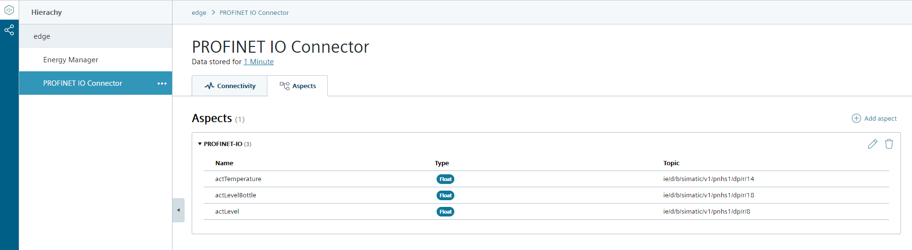
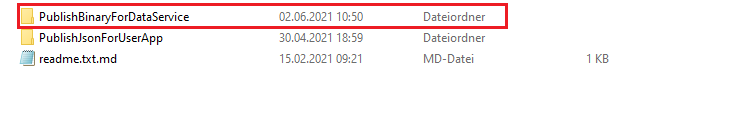

# Configuration 

- [Configuration](#configuration)
  - [Configure Device Layer 2 access](#configure-device-layer-2-access)
  - [Configure PLC Connection](#configure-plc-connection)
    - [TIA Portal HSP for PN Driver](#tia-portal-hsp-for-pn-driver)
    - [Configure Databus](#configure-databus)
    - [Configure Data Service](#configure-data-service)
  - [Configure PROFINET IO Connector](#configure-profinet-io-connector)
    - [Configure PROFINET IO Connector in TIA Portal](#configure-profinet-io-connector-in-tia-portal)
    - [Configure PROFINET IO Configuration Files](#configure-profinet-io-configuration-files)
      - [Configure PROFINET IO with Binary format](#configure-profinet-io-with-binary-format)
      - [Configure PROFINET IO with JSON format](#configure-profinet-io-with-json-format)

## Configure Device Layer 2 access

The device scanner requires a layer 2 access to enable the scanner of the devices in the Machine Insight.

Hint: Layer 2 access can only be configured for a new device, not later.

Open the management system and select "My Edge Devices" on the left side in the bar.

Click on "+ New Edge Device" on the upper right side.

Configure your Edge Device and click on "Next".

Click on the "+" button at the top right to configure the network interface.

Configure the network interface and the layer 2 access and click on "add".

Confirm the device configuration with "Next" and with "Create".

## Configure PLC Connection

To read data from the PLC and provide the data, we will use PROFINET IO Connector to establish connection with the PLC via PROFINET.

The PROFINET IO Connector sends the data to the Databus, where the Data Service app can collect what is needed.

In order to build this infrastructure, these apps must be configured properly:

- TIA Portal HSP for PN Driver
- Databus
- Data Service

### TIA Portal HSP for PN Driver

The PNDriver V2.2 is not included automatically in TIA Portal V16. You have to install the HSP (Hardware Support Package).
You can download the needed HSP 0307 from the Siemens support pages [↗ ID 72341852](https://support.industry.siemens.com/cs/ww/en/view/72341852).

### Configure Databus

In your IEM open the Databus and launch the configurator.

Add a user with this topic:
`"ie/d/b/simatic/v1/pnhs1/dp/r"`
`"ie/m/j/simatic/v1/pnhs1/dp/r"`

Deploy the configuration.

### Configure Data Service

In your IED open the Data Service 

Add a PROFINET IO Connector:

Take the settings what you have used in the Databus:

click on "Assets & Connectivity" at the top of the left-hand page and create your first variables.

Select the PROFINET IO Connector in "Choose an Adapter" and all "profinetxadriver" in "choose a tag":

click on "Aspects" and select all variables.

## Configure PROFINET IO Connector 

The PROFINET IO Connector app can be adjusted according the project's needs. 
Configurarion files enable to configure the behavior of the app.

Download the configuration files "Appendix" below:

https://support.industry.siemens.com/cs/us/en/view/109793251

The IE Databus needs some configuration for the PROFINET IO Connector (topics, user). These settings must fit to the PROFINET IO Connector configuration.
The Profinet configuration is configured with the SIMATIC TIA Portal.

### Configure PROFINET IO Connector in TIA Portal

Click "Devices & Network" at the top of the left side.

Select the PROFINET Driver from the catalog.

The project contains now a PC station with prepared PROFINET Driver. Switch to the Device View.

Next you have to add to the PROFINET Driver the Linux native communication interface.

Click on the PLC properties and select the PROFINET Driver under IO device.

Click on "I-device communication" in the PLC properties to define the inputs, outputs and the length.

Check the transfer area from the I-Device communication.

Example of tag table in TIA Portal.

Corresponding Tag Definition File.

When you create a TIA Portal project with the PROFINET Driver as controller, finally a XML configuration file is generated during the compile of the project. 
This file you have to provide to the PROFINET IO Connector application.

### Configure PROFINET IO Configuration Files

The required PROFINET IO Connector files can be downloaded as a ZIP file under the following link [↗ ID 109793251](https://support.industry.siemens.com/cs/document/109793251/profinet-io-connector?dti=0&lc=de-WW)

The PROFINET IO Connector application requires three configuration files:

- User credentials for IE Databus (pn_hs_adpt_credentials.xml)
- Application settings (pn_hs_adpt_appconfig.xml)
- Profinet configuration (e.g. generated from TIA Portal)
- optional Tag Definition File (pn_hs_adpt_tagdefs.json)

Hint: When you change any config file, you have to restart the app (e.g. via the Web UI of the IEM) to activate the changed configuration!

#### Configure PROFINET IO with Binary format

The binary format is designed for higher performance and is required for the data service.
Note: The Data Service only supports the binary structure and not the JSON structure.

For the binary format, the respective binary files must be uploaded in the Profinet IO Connector.

#### Configure PROFINET IO with JSON format

The JSON format is for easier handling on the client side.

For the JSON format, the respective JSON files must be uploaded in the Profinet IO Connector.

