# PROFINET IO Connector Getting Started: PROFINET IO Connector configuration

- [PROFINET IO Connector Getting Started: PROFINET IO Connector configuration](#profinet-io-connector-getting-started-profinet-io-connector-configuration)
  - [Install necessary applications](#install-necessary-applications)
  - [Configure Common Configurator](#configure-common-configurator)
    - [Configure Databus Credentials](#configure-databus-credentials)
    - [Configure PROFINET IO Connector](#configure-profinet-io-connector)
  - [Configure IIH Essentials](#configure-iih-essentials)
    - [Configure Databus settings](#configure-databus-settings)
    - [Configure Data reading](#configure-data-reading)

## Install necessary applications

In order to configure the PROFINET IO Conenctor in IED and check the received data from PLC, the following applications should be installed on your IED:

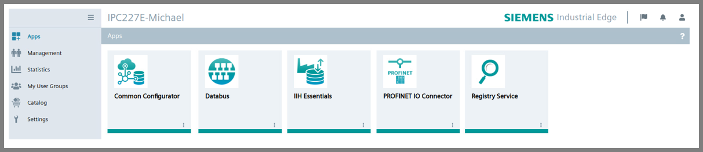

> [!NOTE]  
> It is assumed that the Databus is already configured.

Apart from Databus Configurator it is also necessary to have Common Connector Configurator installed in the IEM Maitenance. 

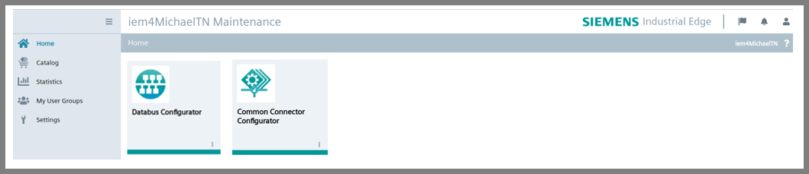

## Configure Common Configurator

### Configure Databus Credentials

Go to the Settings and open Databus Credentials tab. Fill the Databus Service name, Databus Publisher settings (User name and Password) and then click on "Save".

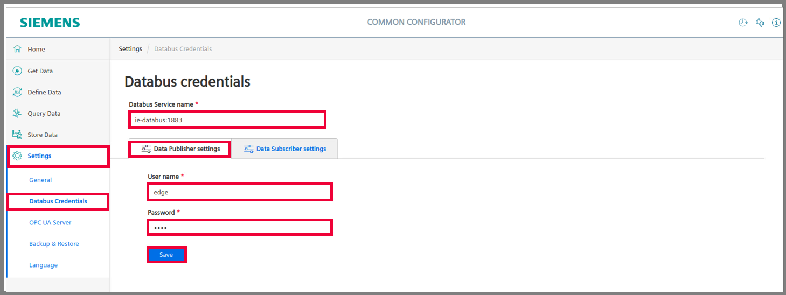

Then, click on "Databus Subscriber settings" and fill the User name and Password as well in there. Finally, click on "Save" again.

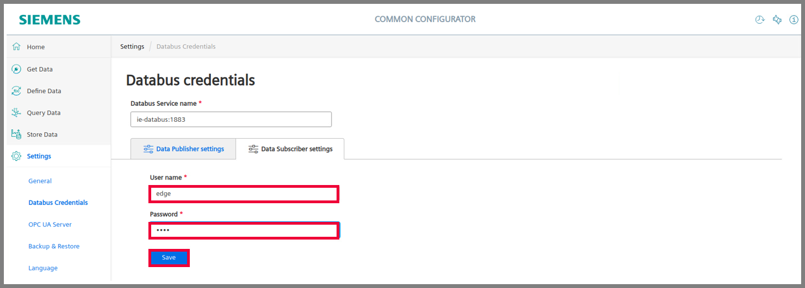

### Configure PROFINET IO Connector

In the your IED UI open the Common Configurator application.

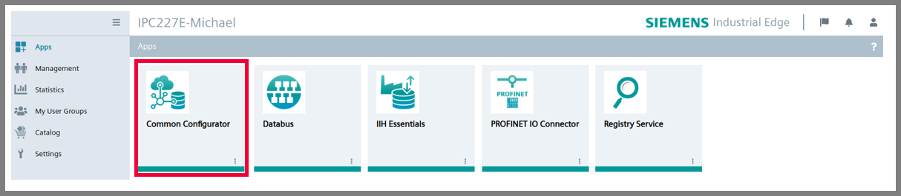

Go to Get Data and click on "Connector Configuration". Then, open the PROFINET IO Connector configuration interface.

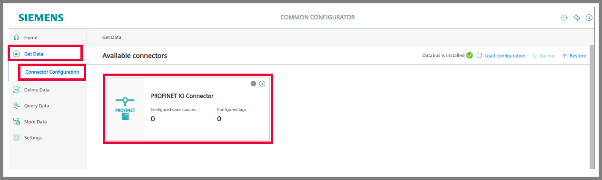

Proceed by going to the Tags tab.

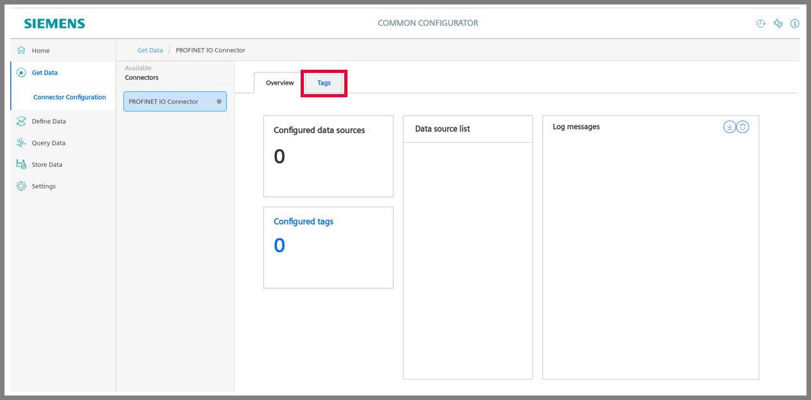

Then, click on "Add data source" and the window for the PROFINET datasource configuration will be opened.

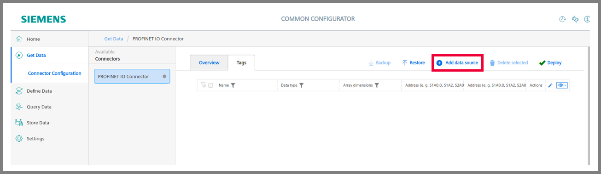

In this window select PROFINET IO Controller as a Communication protocol. Proceed by uploading a file exported from TIA Portal after compilation of PROFINET Driver. Then, set the Realtime task cycle in microseconds. This will be the sampling period of received data over PROFINET. Set the Oversampling factor for MQTT as well. This number says how many samples will be sent in a package to Databus.

> [!TIP]
> Realtime task cycle 10000 microseconds means that the data will be sampled every 10 milliseconds from PLC. Oversampling factor 50 means that 50 samples will be collected during 500 milliseconds (half second) and then sent to MQTT Broker (Databus). In other words every half second 50 samples will be sent to MQTT Broker.

For getting MQTT message in JSON format leave the corresponding check box unchecked. If you wish to receive the message in binary format, check this check box. The binary format of message is used when higher performance of data reading and publishing is required.

The MQTT topics are the content of the rest of this window. You can keep their default addresses. Finally, click on "Save". Then, the PROFINET data source is configured.

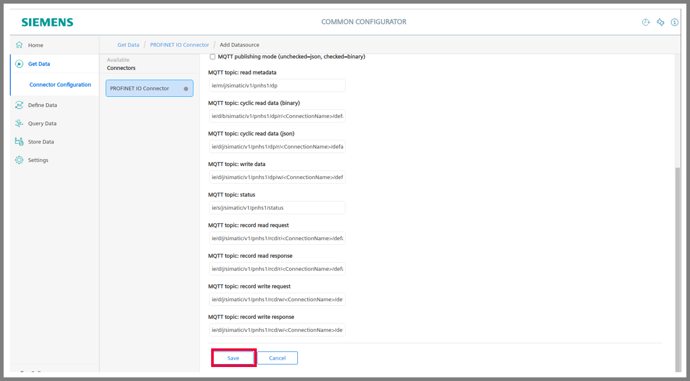

Proceed by clicking on menu under Actions and then on "Add tag".

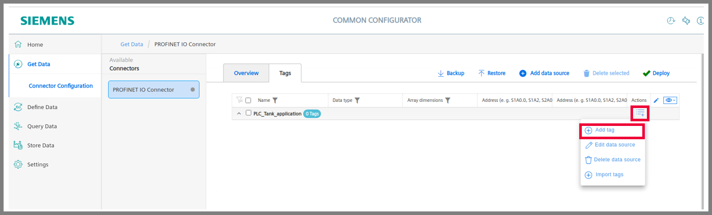

Then, the window for tag configuration will be opened. Here the following information about one tag should be filled:
- Name (up to you)
- Data type (should correspond with tag's data type in TIA Portal)
- Address (output from PLC `"%QD6"` is the input to IED `"%ID6"`)

When information mentioned above are filled, you can click on "Save".

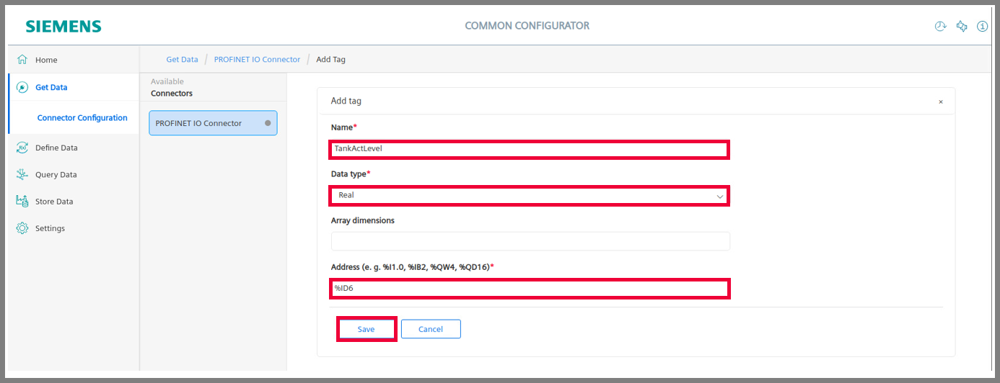

Proceed by configuring all other tags same way as it is described above. Then, select the data source with configured tags and click on "Deploy".

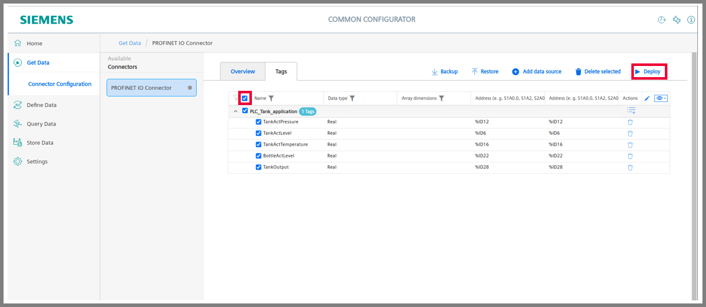

Click to "Overview" tab. Then, if the connection was established successfully, you can see the corresponding log messages.

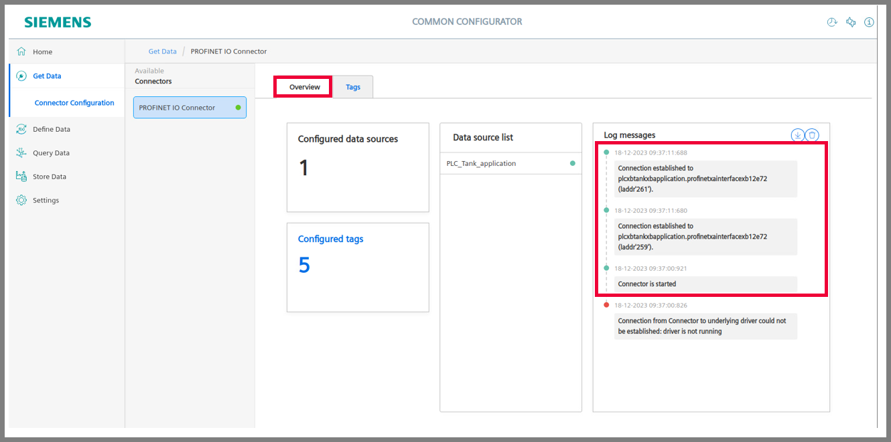

## Configure IIH Essentials

In the your IED UI open the IIH Essentials application.

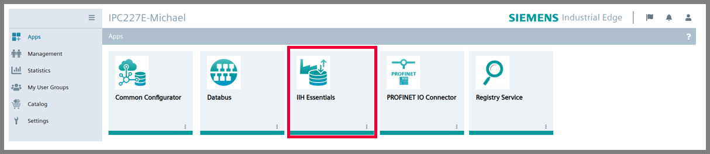

### Configure Databus settings

Go to the Settings and click on "Databus settings".

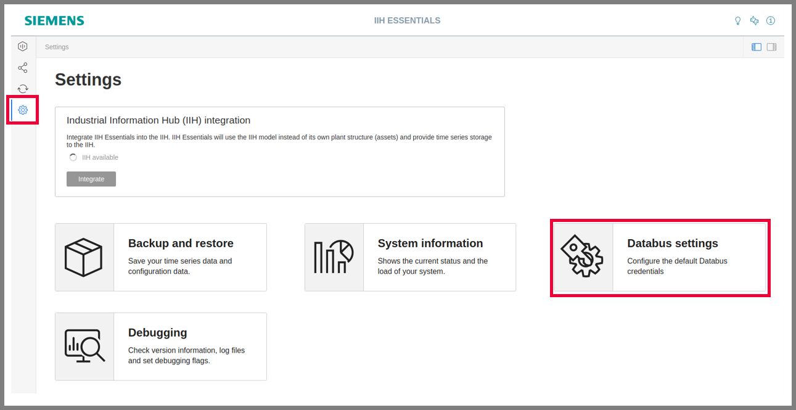

Proceed by clicking on pencil for editing the Databus settings.

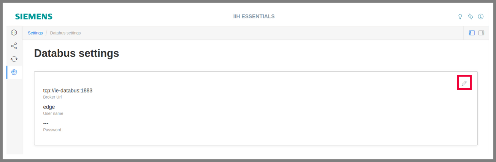

Fill the Broker Url, User name and Password. Finally, click on "Save".

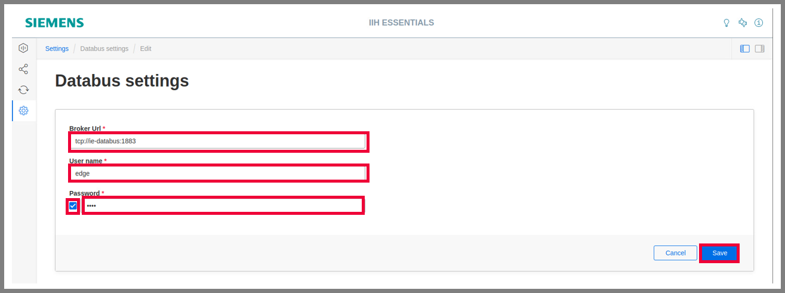

### Configure Data reading

Go to the Connectors tab and click on "PROFINET IO Connector" and open its configuration by clicking on the pencil in the top right corner.

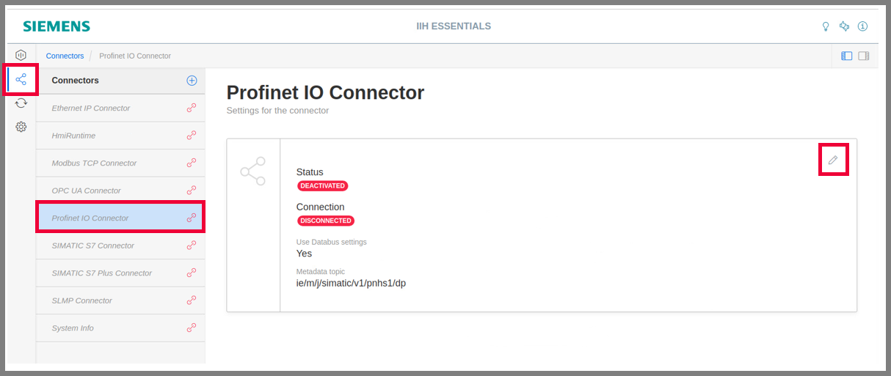

Change the status of the connector to Active and then click on "Save".

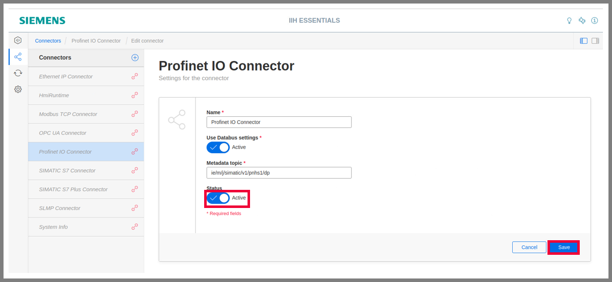

Then, if the connection in Common Configuration was established successfully, you can see that its Status if connector is Active and the status of its connection is Connected.

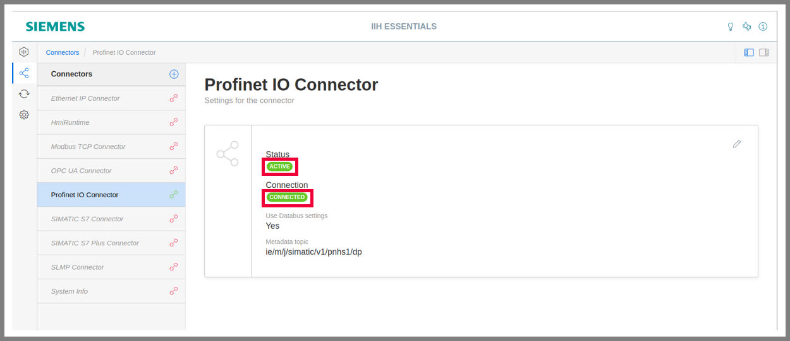

Proceed by going to the Assets & Connectivity tab and click on "Add multiple variables".

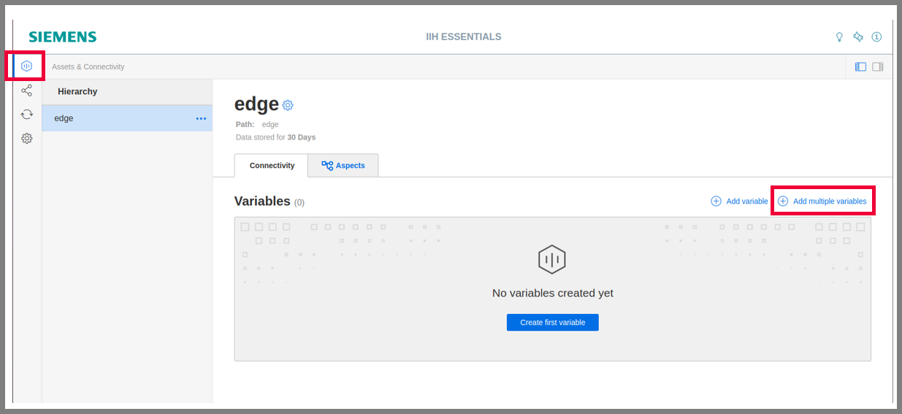

In the next window select the Profinet IO Connector and check the check box for selecting all its variables. Finally, click on "Save".

Then, select the check box "Last values" to see the changes of the configured tags. If everything was configured correctly, you can see how define tags are changing their values.

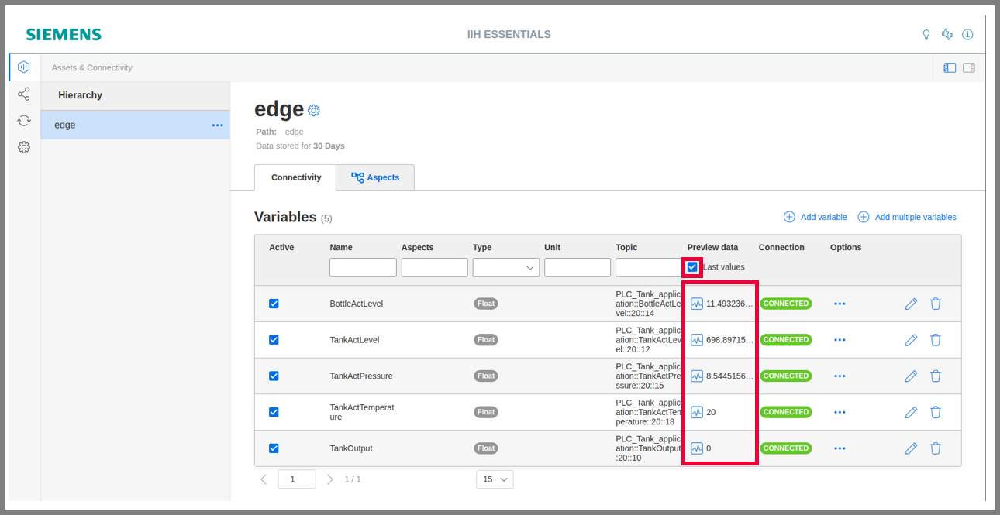
